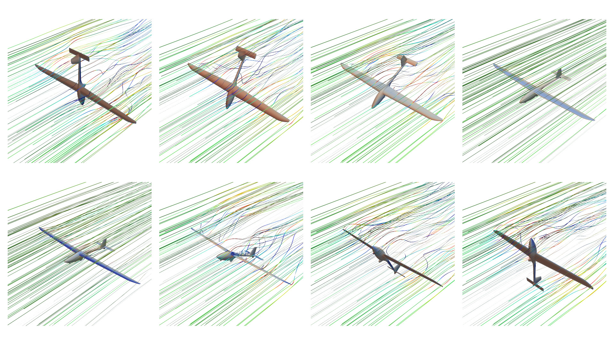
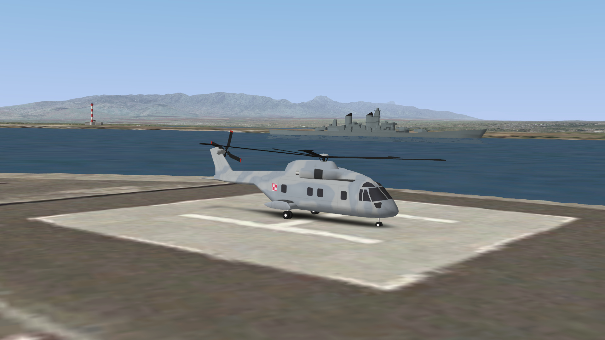

# mscsim
Flight simulation software.

## Installation

### Linux

Linux [deb package](https://github.com/marek-cel/mscsim/releases/download/0.4/mscsim_0.4_focal_amd64.deb) is provided for Ubuntu 20.04 LTS / LinuxMint 20.x.

Additional data packages dependencies are required:

* [mscsim-data](https://github.com/marek-cel/mscsim-data/releases/download/0.4/mscsim-data_0.4_focal_all.deb)
* [mscsim-data-terrain](https://github.com/marek-cel/mscsim-data-terrain/releases/download/0.1/mscsim-data-terrain_0.1_focal_all.deb)

### Windows

Windows [installer](https://github.com/marek-cel/mscsim/releases/download/0.4/mscsim-0.4-win64.exe) is provided. It contains all necessary data.

## Building from source

To build MScSim generate project files with CMake in src directory, then use appropriate building system.

MScSim requires following library dependencies:

* [libxml2](http://www.xmlsoft.org/)
* [OpenAL](https://www.openal.org/) and [ALUT](https://github.com/vancegroup/freealut)
* [OpenScneGraph](http://www.openscenegraph.org/)
* [Qt5](https://www.qt.io/)

### Linux

Additional library dependencies on Linux:

* libX11
* libXss

On Ubuntu based operating systems those dependencies can be installed with the following command:

```sudo apt-get install libalut-dev libopenal-dev libopenscenegraph-dev libqt5opengl5-dev libqt5svg5-dev libqt5x11extras5-dev libqwt-qt5-dev libxml2-dev libx11-dev libxss-dev qtbase5-dev```

### Windows

On Windows those dependencies have to be installed manually.

## Main features

High fidelity flight dynamics model based on available wind tunnel data and/or [CFD](https://en.wikipedia.org/wiki/Computational_fluid_dynamics) simulations including following aircraft types:

* [AW101](https://en.wikipedia.org/wiki/AgustaWestland_AW101) - medium helicopter
* [C-130](https://en.wikipedia.org/wiki/Lockheed_C-130_Hercules) - turboprop transport aircraft
* [Cessna 172](https://en.wikipedia.org/wiki/Cessna_172) - general aviation aircraft
* [F-16](https://en.wikipedia.org/wiki/General_Dynamics_F-16_Fighting_Falcon) - 4th generation jet fighter
* [F-35A](https://en.wikipedia.org/wiki/Lockheed_Martin_F-35_Lightning_II) - 5th generation jet fighter
* [Mustang Mk III](https://en.wikipedia.org/wiki/North_American_P-51_Mustang) - World War II era fighter
* [PW-5](https://en.wikipedia.org/wiki/PW-5) - World Class glider
* [R44](https://en.wikipedia.org/wiki/Robinson_R44) - light helicopter
* [UH-60](https://en.wikipedia.org/wiki/Sikorsky_UH-60_Black_Hawk) - medium helicopter





Electronic Flight Instrument System and Head-up Display common for all aircraft types. Built-in map with navigational radio aids, airports, etc..


High resolution photorealistic scenery based on aerial imagery of Oahu island, low resolution scenery based on satellite imagery of the whole World.


Accurate celestial bodies position with almost 1000 visible stars.


Weather phenomena, such as clouds and fog.


## See also

* [mscsim-cfd](https://github.com/marek-cel/mscsim-cfd)
* [mscsim-data](https://github.com/marek-cel/mscsim-data)
* [mscsim-data-terrain](https://github.com/marek-cel/mscsim-data-terrain)
* [mscsim-docs](https://github.com/marek-cel/mscsim-docs)

Visit [http://marekcel.pl/mscsim](http://marekcel.pl/mscsim) for more information.
